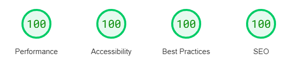

# Astro v4 Starter: TypeScript, Tailwind, and React

Astro v4 with TypeScript, TailwindCSS, and React configured for static site generation (SSG).

Live Preview: https://astrobot.themes.bitcurve.com/

The layout supports responsive navigation, light/dark theme, automatic generation of social media banners, and includes many useful components for pages and blog posts.

Example pages and blog posts demonstrate various features and capabilities. Content pages and blog posts can be written in markdown and mdx.

This project served to try out a few ideas to streamline the development process with TailwindCSS and Astro including the custom **tw-theme-palette** plugin to centralize palette definitions and help quickly customize the design.

[PageSpeed Insights](https://pagespeed.web.dev/) score for web and mobile at the time of writing:

Please share feedback, ideas, and any improvements!

## Highlights

🖊️ Write content in markdown and MDX. You can import react components directly in your pages and posts.

📜 Documented and well-commented. Comments in the astro config (`astro.config.mjs`) include tips and suggestions to help you find success with the amazing Astro even if its new for you.

🛠️ Reasonable configuration of typescript, eslint, prettier, and VSCode (if you use VSCode) ready to customize.

🚀 Productive and scalable tailwind setup including a [project preset](https://tailwindcss.com/docs/presets), [custom plugins](https://tailwindcss.com/docs/plugins), customization rig for the official [@tailwindcss/typography](https://tailwindcss.com/docs/typography-plugin) ("tailwind prose") plugin, and helper functions for tweaking colors and spacing.

🎨 Shiki syntax highlighting for code fence blocks in md/mdx content, configured for easy customization with the tailwind setup.

🦾 Automatically generates `robots.txt`, RSS feed, and opengraph/twitter images on build.

## Development

### Initial Setup

The [pnpm](https://pnpm.io/installation) package manager is recommended for this project.

Run `pnpm install` to install project dependencies.

### Development Server

`pnpm dev` starts the dev server on port 4321: http://localhost:4321.

`pnpm format` formats the codebase with prettier.

## Customization

### Astro vs. React Convention

This codebase follows a convention for Astro vs. React components:

Astro: layouts and functionality directly related to site layout including navigation, theme toggle, etc.

React: in-page/in-app features and components for use within MDX pages.

### Navigation Links

The links in the navigation menu are defined in `src/constants.ts`.

Take care to use a trailingSlash on `href` values per the Astro config.

### Styling & Theming

Refer to the documentation:

- [Astrobot Docs: Customization & Styling with TailwindCSS](docs/customization-styling.md)
- [Astrobot Docs: Patterns for Customization, Composability, and Reusability](docs/astrobot-customization-patterns.md)
- [Astrobot Docs: The tw-theme-palette Plugin & Theme Palette Definition](docs/tw-theme-palette-plugin.md)

### Environment

This template defines environment variables in `.env` and `.env.development` files.

- `.env` - common variables shared in both development and production environments
- `.env.development` - only apply when the dev server is running; variables will override `.env`

Review `.env` and `.env.development` and customize the values as required.

You can add `.env.production` to specify production-only values that are only applied at build time.

Do not commit secrets to git. If you add secrets to any environment files then add those files to `.gitignore`.

The `ASTRO_CONFIG_SITE_URL` variable is used in the Astro config file to define the `site` property. This value must correctly reflect your production URL for effective production deployment and SEO.

Astro requires that environment variables are named with prefix `PUBLIC_` to publicly expose them to clients.
Take care to never expose any secrets or confidential keys to the front-end.

Astro substitutes in-place any environment variables it finds in the code with their values during build-time. For example `import.meta.env.PUBLIC_ENV_VAR_NAME` will be replaced with its literal value. Dynamic `env` property names (computed keys) are not supported.

It is a good practice to stop and restart the development server after editing environment variables.

### Tooling

Review project tooling and related configuration files and customize them to your liking:

- `.eslintrc.cjs`
- `prettierrc.mjs`
- `tailwind.config.js`
- `astro.config.mjs`

Edit `src/constants.ts` to customize the layout and navigation.

If you use VSCode review the `extensions.json` and `settings.json` files under the `.vscode/` directories.

## Deployment

### Pre-Deployment Checklist

- [Astrobot Docs: Predeploy Checklist](docs/astrobot-predeploy-checklist.md)

### Deployment Tips

#### URL Handling

Ensure your deployment/hosting provider supports and/or is configured for compatibility with `trailingSlash: true` per the Astro config. The entire project should be consistent.

For example:

- Apache2 should be configured with the _default directory index_ option enabled (it is typically enabled by default).
- AWS may require a CloudFront Function or an Edge Lambda to support directory indexes and handle trailing slashes when hosting with S3 and/or CloudFront. This functionality may be automatically included \[with various restrictions and caveats\] when using a "canned" AWS service such as Amplify or Elastic Beanstalk.

## Project History

This repo was first created via the astro cli from the official Astro v3 tailwind template: `with-tailwindcss` then customized and upgraded from that point: `pnpm create astro@latest -- --template with-tailwindcss`.

The Astro v4 template was released in 2024-01.

## Official Docs References

### Astro

- https://docs.astro.build/en/guides/typescript/
- https://docs.astro.build/en/guides/environment-variables/
- https://docs.astro.build/en/guides/configuring-astro/#environment-variables
- https://docs.astro.build/core-concepts/astro-components/
- https://docs.astro.build/en/guides/view-transitions/
- https://docs.astro.build/en/guides/integrations-guide/tailwind

## License

© 2024 Kevin Firko (@firxworx)
© 2024 Bitcurve Systems Inc. (Canada)

Released under MIT license.

Font files under the `src/assets` folder are not included in the scope of the copyright claim or MIT license.

The Inter typeface is distributed under the terms of the SIL Open Font License 1.1: [Inter SIL License](https://raw.githubusercontent.com/rsms/inter/v4.0/LICENSE.txt).

The design and original SVG data of icon components based on HeroIcons are © Refactoring UI Inc. and distributed under the terms of the [MIT license](https://github.com/tailwindlabs/heroicons/blob/master/LICENSE).

The `LogoIpsum` component is based on an SVG distributed under its own license: https://logoipsum.com/license
